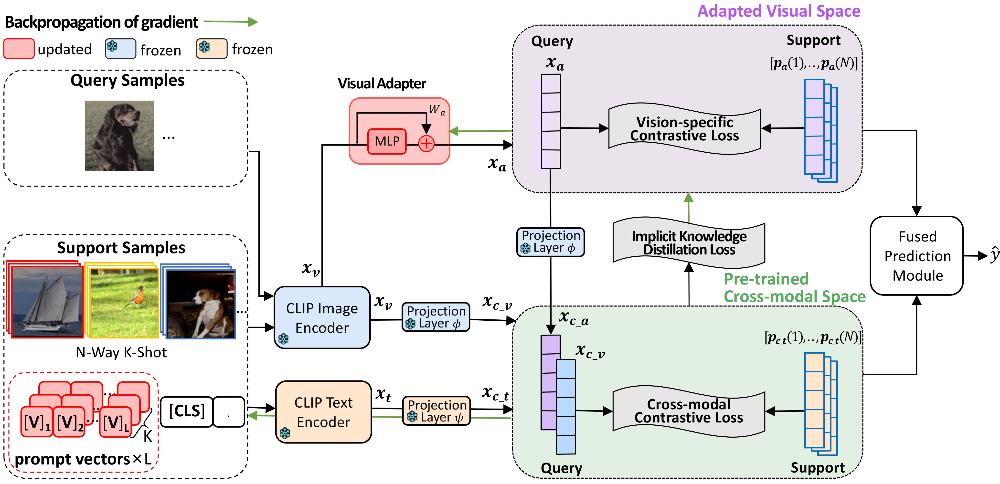

# SgVA-CLIP: Semantic-guided Visual Adapting of Vision-Language Models for Few-shot Image Classification
[[Paper]](https://ieeexplore.ieee.org/abstract/document/10243119)
[[Arxiv]](https://arxiv.org/abs/2211.16191)

**Model Architecture**



**Running Environment**

Refer to [CLIP](https://github.com/openai/CLIP) and [CoOp](https://github.com/KaiyangZhou/CoOp)

**Train Example**

```
python -W ignore main_5.py --phase metatrain --gpu 0 --save-path ''
--train-way 50 --test-way 10 --train-shot 16 --val-shot 16 --train-query 50 --val-query 50
--loss newi2i+kd+i2t
--para-update prompt+v_adapter
--adapter-dim _dim_x2
--visual-pre 'T'
--head Vision-Text
--network CLIP
--backbone RN50
--test-head Fuse_af
--dataset ImageNet
--n-classes 1000
--warm-up True
--num-epoch 100
--ctx-init ensemble
--n-ctx 4
--lr-decay cosine
--episodes-per-batch 1
--lam2 0.1
```

**Test Example**

```
python -W ignore main_5.py --phase metatest --gpu 0 --save-path ''
--train-way 49 --test-way 10 --train-shot 16 --val-shot 16 --train-query 50 --val-query 50 
--loss newi2i+kd+i2t 
--para-update prompt+v_adapter 
--adapter-dim _dim_x2 
--visual-pre 'T' 
--head Vision-Text 
--network CLIP 
--backbone RN50 
--test-head Fuse_af 
--dataset SUN397 
--n-classes 397 
--warm-up True 
--num-epoch 100 
--ctx-init 'a photo of a' 
--n-ctx 4 
--lr-decay cosine 
--episodes-per-batch 1 
--lam2 0.1
```

**Cite**
```
@article{peng2023sgva,
  title={Sgva-clip: Semantic-guided visual adapting of vision-language models for few-shot image classification},
  author={Peng, Fang and Yang, Xiaoshan and Xiao, Linhui and Wang, Yaowei and Xu, Changsheng},
  journal={IEEE Transactions on Multimedia},
  volume={26},
  pages={3469--3480},
  year={2023},
  publisher={IEEE}
}
```
